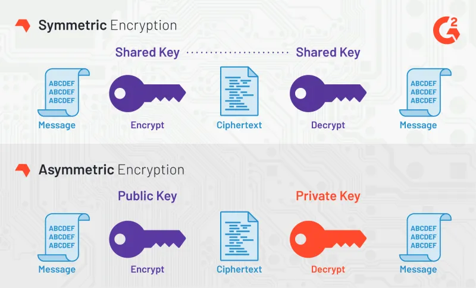

## Symmetric vs Asymmetric

In the context of password managers, cryptography is used to secure data at rest. Typically, a "vault" of passwords is safely stored so that only authorized parties can gain access.

Protecting files at rest, or more specifically, protecting files for oneself is usually accomplished via symmetric encryption, which means encryption and decryption use the same key.

Asymmetric encryption uses two keys, and we'll talk more about it later.

## Assignment

A developer at Passly was confused and committed a bug. They assumed that an asymmetric cipher was being used, but we're using a symmetric cipher.

Luckily, they didn't break production, just the debugging suite. Fix the bug. You should see decrypted messages in plaintext.

You'll need to alter the function signature of debugEncryptDecrypt. You'll only need to use the masterKey defined in main(), you can delete the masterKeyDecrypt value.
